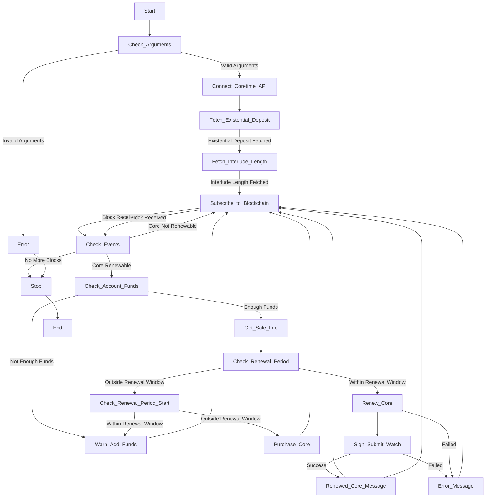

# coretime-renewal-bot

#### *DISCLAIMER: This code is an example on how to handle a Core's coretime renewal using subxt and is not meant for use in production in any way. It uses Alice's dev account and a zombienet for testing purposes.*

### What This Bot Does:

This bot has a few key jobs:

* Check Renewal: It looks at the Coretime Chain to see if the core you're interested in is renewable.
* Check Funds: If the core is renewable, it peeks at your account balance to make sure you have enough funds for the renewal.
* Call the Broker: If funds are good to go, it tells the broker to renew the core.
* Keep Track of Time: The bot also keeps an eye on the renewal period. It lets you know if the core was successfully renewed or not. If not, it tells you why – either the funds ran out or the renewal window slipped by.

### How It Works:

The bot uses subxt to talk to the Coretime Chain. It queries for the core's renewal status and checks the account balance. If everything's a go, it tells the broker to renew the core.

The bot also manages the renewal period and updates its status accordingly. It gives you a clear read on the core's renewal status (renewed or not) and the reason for any failures.

### Example Setup:

To get this bot up and running, you'll need to swap out Alice's dev account and the zombienet with your own KeyPair and RPC endpoint. Or, you can tweak the code to build the transaction and sign it offline.


### Running the example

For running the example and seeing its behaviour, we use [`zombienet v1.3.102`](https://github.com/paritytech/zombienet/tree/v1.3.102)
with the `polkadot`, `polkadot-execute-worker` and `polkadot-prepare-worker` with
`--features fast-runtime`, and `polkadot-parachain`,
built from source ([tested with v1.10.0](https://github.com/paritytech/polkadot-sdk/tree/polkadot-v1.10.0)).

We also use the `subxt cli`. For installing you can run:
```bash
cargo install subxt-cli
```

Then we need to run the following command to retrieve the metadata from the `coretime rococo` parachain:
```bash
subxt metadata --url https://rococo-coretime-rpc.polkadot.io -f bytes > metadata.scale
```
After this was setup, we need to start the `zombienet` with:
```bash
./zombienet-linux-x64 -p native spawn ./config/coretime-network.toml
```
Wait for it to be up and then open a new terminal and run:
```bash
yarn start
```
This will setup the cores and tasks. Once those txs are done, we can run the bot with:

```bash
cargo run <URL> <CORE_NUMBER>
```

### Diagram


